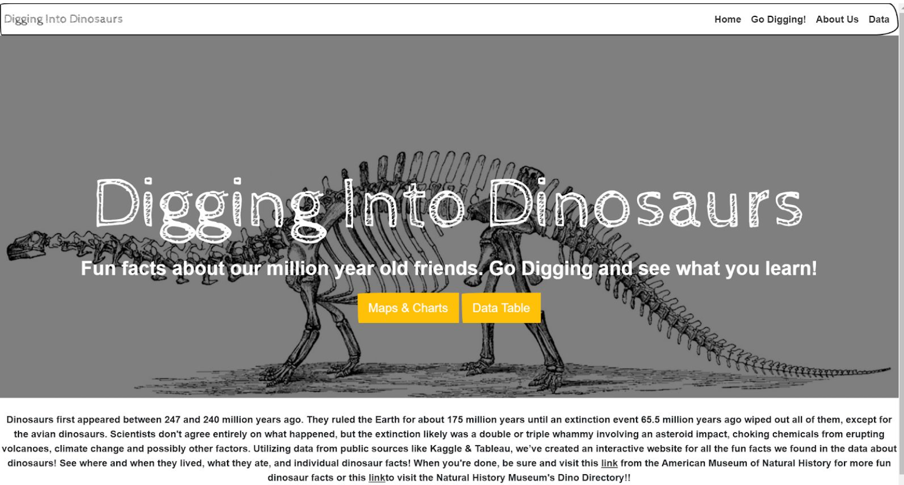

# voyage-project-tier1-dinosaurs

## Table of Contents

- [Overview](#overview)
- [General Instructions](#general-instructions)
- [Requirements & Specifications](#requirements-specifications)
- [Acknowledgements](#acknowledgements)
- [About Chingu](#about-chingu)

## Overview

Hey there! How about we create an app all about dinosaurs? We've got our data all
set from the National History Museum that tells us about different dinosaurs.

Imagine our app like a dino world! We can show all kinds of dinosaurs – big ones
looking for food, calm ones eating plants, and even tiny ones running around. From
huge dinosaurs that made the ground shake to little ones in the forests.

And get this, our tool might even let us time-travel! Imagine going back in time to
see how these dinosaurs lived. Plus, it tells us what type of dinosaur it is and
where it used to call home. So, you'll get to know dinosaurs from all over the place.

We're thinking of adding a cool twist – using News data to show you the latest
discoveries about dinosaurs. Pretty cool, huh?

Let's make an app that's not just smart but also super fun for everyone!

- Dinosaur example website

- Dinosaurs example map

- Dinosaurs example charts

Your Chingu Voyage team will be using this data to create an web app that will help
anyone interested to be able to “dig” into the fossil data and discover facts
about dinosaurs in a unique way. Your app will summarize this data and will allow
users to apply a single filter to multiple visualizations simultaneously.

This will provide you with an opportunity to build Web Development experience
dealing with large volumes of dinosaurs & news data, charts, maps, and user queries.

## General Instructions

This project is designed to be worked on by a team rather than an individual
Chingu. This means you and your team will need to thoroughly read and
understand the requirements and specifications below, **_and_** define and
manage your project following the _Agile Methodology_ defined in the
[Voyage Handbook](https://github.com/chingu-voyages/Handbook/blob/main/docs/guides/voyage/voyage.md#voyage-guide).

As you create this project make sure it meets all of the requirements, but once
it reaches MVP, start implementing the optional features or get creative and
extend it in ways we haven't envisioned. In other words, use the power of
teamwork to make it distinctive and unique.

Take note that we haven't given specific direction on what your UI/UX should
look like. This is another area where you and your team can put your creativity
to work!

## Requirements & Specifications

### What You Need to Do

The following define the minimum requirements and ideas for features you may
implement to enhance this app, if time permits.

#### Structure

- [ ] This is a purely frontend application. No backend is required.
- [ ] You may use any languages, tools, or libraries you prefer when designing and building this app.
- [ ] You may **_NOT_** use AI-base solution generators like GitHub CoPilot.
- [ ] The app should facilitate connectivity to the OpenAI API for color recognition.
- [ ] Integrate a color picker feature allowing users to select colors, example [Color picker](https://iro.js.org/).
- [ ] Useful links and resources:
  - [Wiki about Color Scheme](https://en.wikipedia.org/wiki/Color_scheme)
  - [Open AI API docs](https://platform.openai.com/docs/introduction)

#### Styling

- [ ] Surprise us!!! Use your teams creativity to make this app distinctive.
- [ ] Add a footer containing a link to your teams GitHub repo
- [ ] In general, you will find these [UI design principles](https://www.justinmind.com/ui-design/principles) helpful.
- [ ] Recommend using this resource for [clean CSS](https://israelmitolu.hashnode.dev/writing-cleaner-css-using-bem-methodology)

#### Functionality

- Overview:
  - [ ] Develop a single-page application (SPA) or its equivalent to deliver intuitive color recommendation functionality to users.
- Color Capture and Processing:

  - [ ] Enable users to select colors using a color picker tool within the application.
  - [ ] Implement functionality to capture the selected color's data.

- API Connectivity and Response Handling:

  - [ ] Establish connectivity to the Open AI API for color analysis via provided API key.
  - [ ] Ensure robust error handling for API connectivity, data formatting, and response processing.
  - [ ] Send the captured color data to the API as part of the prompt.
  - [ ] Retrieve and process the response from the OpenAI API.

- Visual Representation:

  - [ ] Visualize the response from the Open AI API using colors.
  - [ ] Implement a method to represent the AI-generated color response in a visually comprehensible manner.

- User Experience:

  - [ ] Ensure the application provides a seamless user experience for color selection, processing, and response visualization.
  - [ ] Implement intuitive UI/UX elements to guide users through the color capture and analysis process.

- Responsiveness
  - [ ] Ensure the web application is responsive and accessible across various devices and screen sizes.
  - [ ] Utilize responsive design techniques to adapt to different viewport sizes.

### Extras (Not Required)

- Color Capture and Processing
  - [ ] Incorporate color theory principles such as analogic colors, triadic colors, or complimentary colors into the color recommendation process.
  - [ ] Provide users with options to explore color harmonies and combinations based on established color theory principles.

## Acceptance Criteria

- Search Functionality

  - [ ] Users should be able to accurately select colors using the integrated color picker.
  - [ ] Captured color data must be correctly formatted and included in the prompt sent to the OpenAI API for analysis.
  - [ ] The application should effectively process the response from the OpenAI API, providing meaningful insights into the selected color.

- API Connectivity and Response Handling

  - [ ] The application must establish reliable connectivity to the OpenAI API for color analysis.
  - [ ] Response handling mechanisms should accurately interpret and extract relevant information from the API response.
  - [ ] Error handling must be implemented to gracefully manage any issues encountered during API communication.

- Visual Representation
  - [ ] The AI-generated color response should be visually represented in a clear and understandable manner within the application interface.
  - [ ] Visual representations should effectively convey the characteristics and attributes of the analyzed color.

## Acknowledgements

Acknowledgements
We express gratitude to the [OpenAI](https://openai.com/)team for providing access to their API, enabling us to incorporate advanced color analysis capabilities into our application.
Additionally, we appreciate the contributions of the wider developer community whose insights and expertise continually enrich our projects.

Special thanks to the creators and contributors of the [iro.js](https://iro.js.org/)library, which facilitated seamless color selection and capture within our application.

## About Chingu

If you aren’t yet a member of Chingu we invite you to join us. We help our
members transform what they’ve learned in courses & tutorials into the
practical experience employers need and want.
